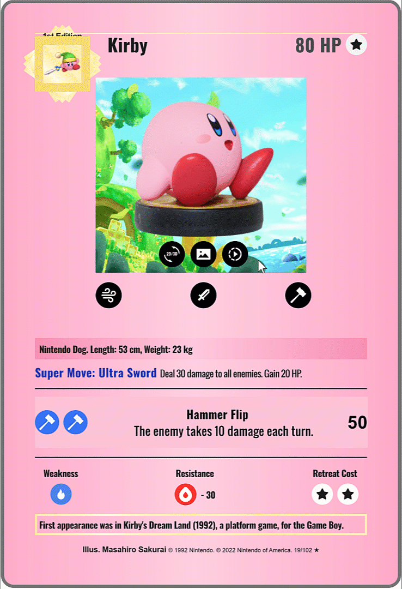

# Digital Card Project

## Introduction

The purpose of this project is to present and market a digital collectable card game. These cards are based on classic video game characters and are designed with a retro aesthetic to appeal to those familiar with 80s and 90s culture. To provide lasting value for users’ cards are upgradable in various ways to add additional models, animation, and sound. Cards are also able to be traded and sold within the service.

These digital cards are sold online via our storefront. Cards are sold as a “base” model starting off. This is to encourage consumers to interact with the product in various ways such as writing a review for the product and sharing their impressions on social networks. Over time new cosmetic features will unlock to encourage users to continue using the service.

The details for this project can be found at **[this site](https://digitalcard.myportfolio.com/).**

## Implementation

* A prototype card viewer is included with the site **[here](./viewer/index.html)**
* The content *Asset Library* can be found **[here](https://guannan-kwok.github.io/assetLibrary/assetLibrary.html)**

| | | 
| :--: | :--: |
|  |  |
| | |

The following site demonstrates a sample implementation of the project which takes the following elements:

* Video game character content: Images, models and materials for "hero" characters and "props".
* Card collection elements: custom vector graphics, icons, logos.
* Character customization and help: Custom Javascript triggers, tooltips / help sections.
* 2D and 3D visualization: Materials, lighting amd environment options.

to compose a Web-based digital playing card.

Assets can be reused to generate additional associated material such as the following poster which combines existing and new 3d elements (scene) with new 2d elements (2d graphics). 

